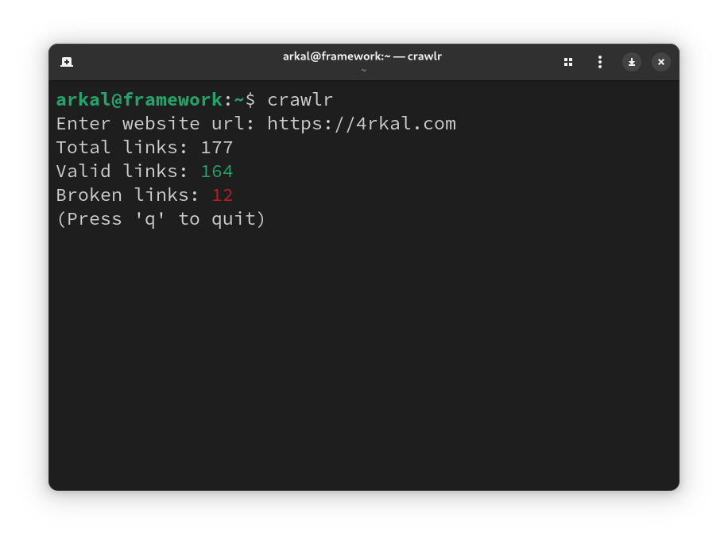

# crawlr
Find and fix broken links in your websites

## Features

- Extracts and checks links from a webpage.

- Saves results in `urls.csv`.

- Uses concurrency for faster scanning.

## Usage

Clone the repo:

`git clone https://github.com/4rkal/crawlr`

`cd crawlr`

`go run .`

Enter website url (including https://)

Read urls.csv and find broken links.
